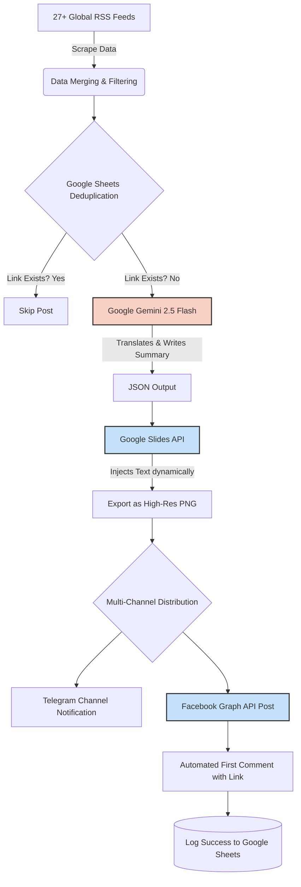

# 🚀 Automated News Aggregator & AI Distribution Pipeline

An enterprise-grade, fully autonomous news aggregation and distribution backend built with **n8n**. This pipeline acts as an automated "News Desk"—fetching global news, rewriting content using AI, generating dynamic graphical news cards, and distributing them across multiple social channels.

## 🛠️ Tech Stack & Integrations
* **Core Engine:** n8n (Self-hosted)
* **Data Sources:** 27+ Global RSS Feeds (Google News, BBC, CNN, Al Jazeera, Reuters, etc.)
* **AI Processing:** Google Gemini 2.5 Flash (LLM)
* **Database / Anti-Duplication:** Google Sheets API
* **Dynamic Graphics Engine:** Google Slides API (for automated image rendering)
* **Distribution Channels:** Telegram Bot API, Facebook Graph API v20.0

## ⚙️ The Workflow Architecture
Here is a step-by-step breakdown of how the logic flows:

1. **Scheduled Triggers & Aggregation:** The workflow wakes up every 10 hours, scraping and merging data from 27+ top-tier global news RSS feeds.
2. **Deduplication Engine:** Before processing, it checks a Google Sheet database to ensure the news link hasn't been posted before, preventing duplicate alerts.
3. **AI Journalism (Gemini 2.5 Flash):** The raw news is sent to Gemini with a strict system prompt. The AI acts as a Chief News Editor—categorizing the news, generating a short SEO-optimized Bengali headline, writing a human-like summary, and injecting trending hashtags, outputting everything in strict JSON.
4. **Dynamic Image Generation:** The AI-generated headline and date are dynamically injected into a predefined Google Slides template. The slide is then seamlessly exported as a high-quality `.png` file using HTTP requests.
5. **Multi-Channel Distribution:** * **Telegram:** Instantly pushes the text summary and the generated graphical news card to a dedicated channel.
   * **Facebook Page:** Uses the Meta Graph API to post the dynamic image along with the AI-crafted caption. It also features an automated first-comment setup for the source link.
6. **Data Logging:** Successfully published posts are appended to the Google Sheet with timestamps for future deduplication and analytics.

## 🚧 Challenges & Real-World Problem Solving
Building this pipeline required overcoming strict platform limitations. The most notable challenge was navigating **Meta's strict App Review and Privacy Policy requirements** for the Facebook Graph API in Development mode. While the backend logic and API calls (`/photos` and `/comments` endpoints) are perfectly structured with Permanent Page Access Tokens, absolute public visibility relies on Facebook's internal app approval process. This required building fallback mechanisms and mastering direct `HTTP Request` nodes in n8n over standard modules to bypass continuous token expiration.

## 💡 Key Takeaways
This project demonstrates advanced capabilities in:
* **JSON Parsing & Data Transformation** (Handling complex arrays from multiple feeds).
* **Cost-effective dynamic image generation** (Using Google Slides as an alternative to expensive APIs like Bannerbear).
* **API Rate Limiting & Flow Control** (Implementing Wait nodes and Batches to prevent server overload).
* **Resilient Error Handling** (Ensuring the flow continues even if a specific API endpoint fails).

### 🔄 System Architecture & Data Flow Diagram

### 📸 Project Screenshots

